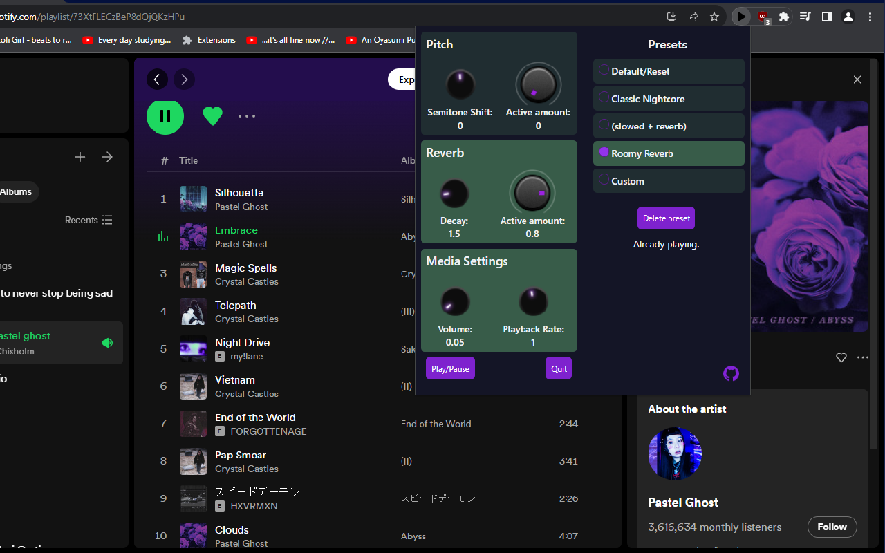
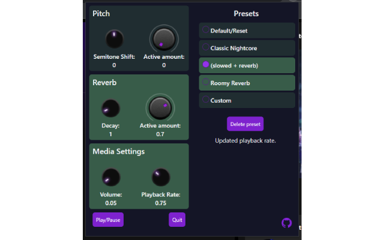

# Audio Mixer



Audio Mixer is a browser extension that currently works on Chromium-based browsers, e.g Chrome and Microsoft Edge. It allows you to apply audio presets to most websites playing audio such as YouTube, SoundCloud, Spotify.

The presets were built around Nightcore but have expanded to include: pitch, reverb and playback rate. The extension lets you create and save custom presets.

# Building

To build and load the extension from source run:

```
if you don't want git history:
degit Kernocal/audio-mixer-extension <folder-name>

or if you do:
git clone https://github.com/Kernocal/audio-mixer-extension.git <folder-name>

cd <folder-name>
pnpm install

pnpm run build:main
```

Then you can load unpacked using the created /build folder.

# About

The extension is built with SvelteKit, using the browser extension adapter.
UnoCSS for styling.

# Known Issues

1. When many tabs are open the pinned tab doesn't get shrunk.
2. Websites that create audio dynamically using js must be added specifically to extension permissions in order to work.  

# Credits

[SvelteKit Browser Extension Adapter](https://github.com/michmich112/sveltekit-adapter-chrome-extension), by michmich112.

[Initial Adapter](https://github.com/antony/sveltekit-adapter-browser-extension), by antony.

[Tone.js](https://tonejs.github.io/), by tambien.

[tapCapture for manifest v3](https://github.com/zhw2590582/chrome-audio-capture), by zhw2590582.

