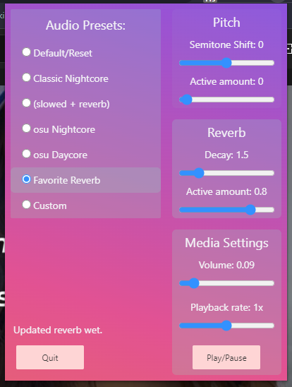

# Audio Mixer



Audio Mixer is a browser extension that currently works on Chrome and Edge. It allows you to apply audio presets to any website playing audio such as Youtube, Soundcloud, Spotify.

The presets were built around Nightcore but have expanded to includes others such as

1. (slowed + reverb)
2. osu based Nightcore
3. osu based Daycore

Custom values are also supported.

# Building

To build and load the extension from source run:

```
if you don't want git history:
degit Kernocal/audio-mixer-extension <folder-name>

or if you do:
git clone https://github.com/Kernocal/audio-mixer-extension <folder-name>

cd <folder-name>
npm run build
```

Then you can load unpacked using the created /build folder.

# About

The extension is built with Svelte, using SvelteKit with the browser extension adapter.
Windi CSS for styling.
Tone.js for pitch and reverb effects.

# Known Issues

1. When many tabs are open the options tab doesn't get shrunk even though it's pinned.s
2. The extension cannot change playback rate or volume on sites that dynamically create their audio element(s), pitch and reverb changes still work.

# Credits

The SvelteKit [browser extension adapter](https://github.com/antony/sveltekit-adapter-browser-extension), by antony.  
[Tone.js](https://tonejs.github.io/) for PitchShift and reverb, by tambien.  
The initial [tapCapture model](https://github.com/zhw2590582/chrome-audio-capture) which uses unique options method for manifest v3, by zhw2590582.
