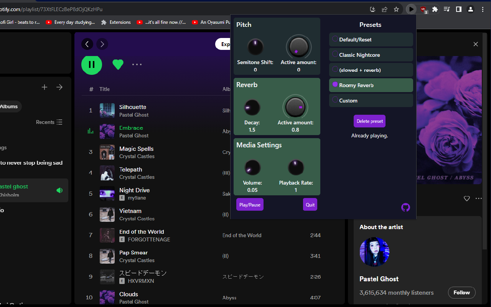
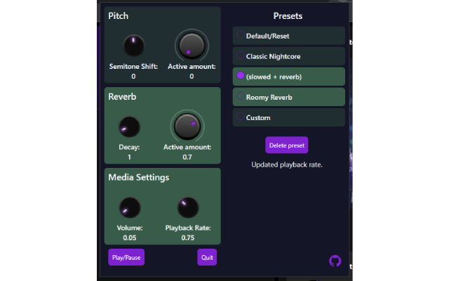

# Audio Mixer



Audio Mixer is a browser extension that currently works on Chromium-based browsers, e.g Chrome and Microsoft Edge. It allows you to apply audio presets to most websites playing audio such as YouTube, SoundCloud, Spotify.

The presets were built around Nightcore but have expanded to include reverb. The extension lets you create custom presets though.

# Building

To build and load the extension from source run:

```
if you don't want git history:
degit Kernocal/audio-mixer-extension <folder-name>

or if you do:
git clone https://github.com/Kernocal/audio-mixer-extension.git <folder-name>

pnpm install

pnpm run build
```

Then you can load unpacked using the created folder in ./output.

# About

UnoCSS for styling.

# Credits


[Tone.js](https://tonejs.github.io/), by tambien.

[tapCapture for manifest v3](https://github.com/zhw2590582/chrome-audio-capture), by zhw2590582.
