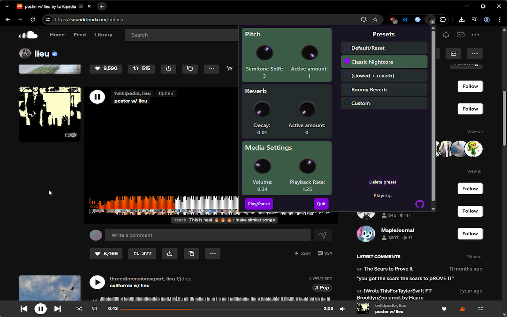
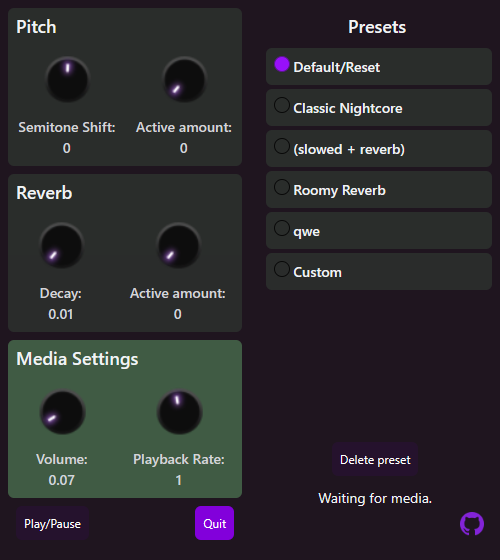

## Music Mixer
<p float="left">
<a href="https://chrome.google.com/webstore/detail/ilfcefenjflalkfibcfjjjhpbjmkiang" style="text-decoration: none;">

</a>
<a href="https://microsoftedge.microsoft.com/addons/detail/eeimcbbmlncdkekcgoodnafbgeopllle" style="text-decoration: none;">

</a>
</p>

Applies presets to audio on most websites such as Spotify, SoundCloud, and YouTube.
The presets were built around Nightcore but have expanded to include reverb.
You can also create custom presets with whatever values you want.

Features:
- Pitch shifting with semitone control
- Reverb with adjustable decay
- Change playback speed
- Save and load custom presets

### Building

To build and load the extension from source run:

```
degit Kernocal/audio-mixer-extension <folder-name>

pnpm install

pnpm run build

go to chrome://extensions/ (enable developer mode)

load unpacked folder <folder-name>/.output/chrome-mv3
```


### Acknowledgements

[Aklinker1](https://github.com/sponsors/aklinker1) making extension development bareable:
- [WXT](https://wxt.dev/)
- [webext-core](https://github.com/aklinker1/webext-core)
- [publish-browser-extension](https://github.com/aklinker1/publish-browser-extension)

[Antfu's](https://github.com/sponsors/antfu) really cool projects:
- [eslint-config](https://github.com/antfu/eslint-config)
- [UnoCSS](https://unocss.dev/)
- [unimport](https://github.com/unjs/unimport)

[Svelte](https://svelte.dev/)

[Tone.js](https://tonejs.github.io/)

[Initial MV3 approach to capture media](https://github.com/zhw2590582/chrome-audio-capture)


